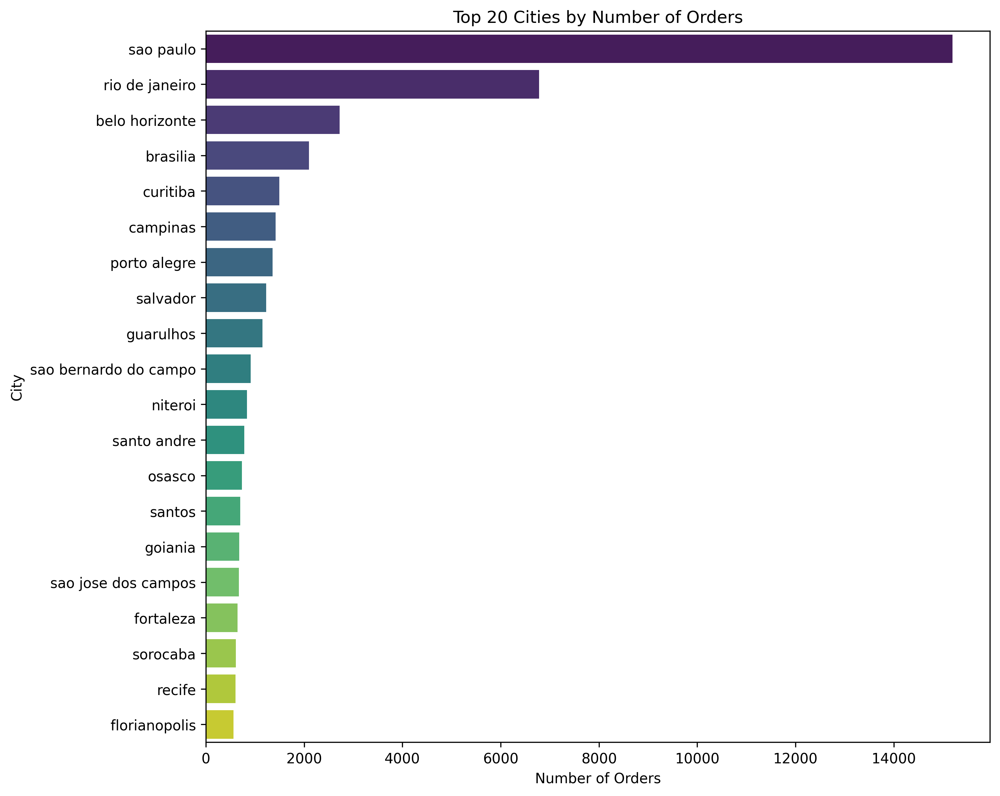
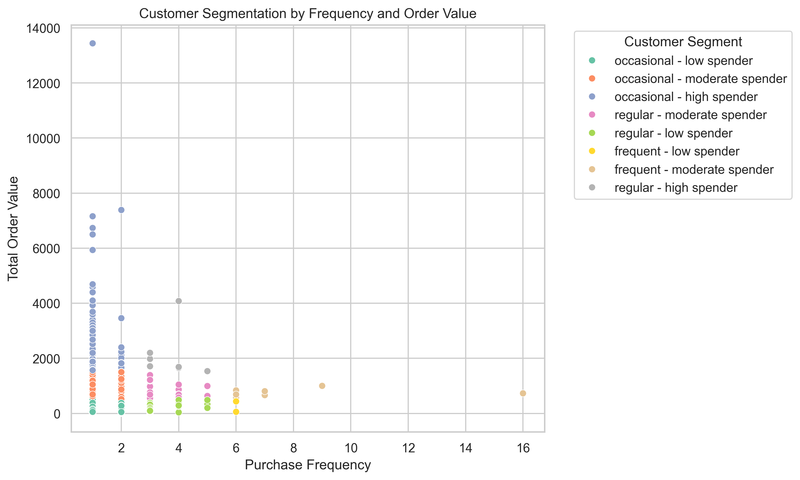
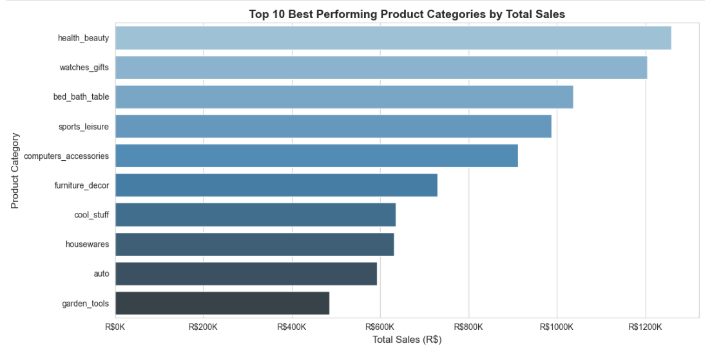
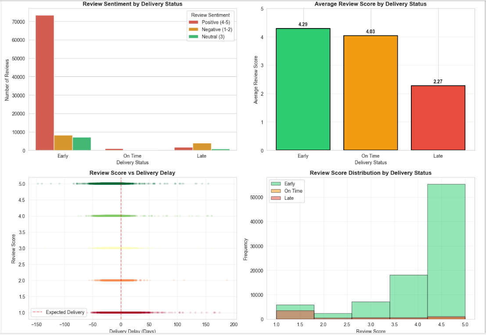
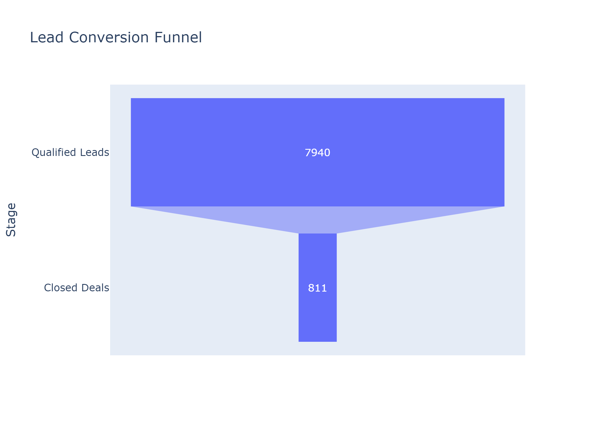
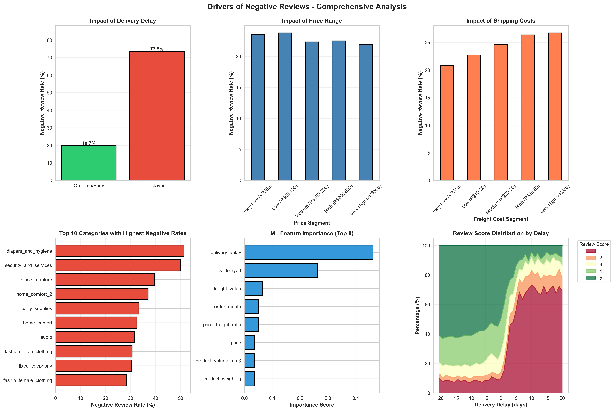

# 🛍️ Brazilian E-Commerce Analytics & Predictive Intelligence

[](https://www.python.org/)
[](https://pandas.pydata.org/)
[](https://scikit-learn.org/)
[](https://dash.plotly.com/)


[](LICENSE)

> **A comprehensive data science project delivering actionable insights for e-commerce optimization through advanced analytics, machine learning, and interactive business intelligence dashboards.**

---

## 📋 Table of Contents

- [Project Overview](#-project-overview)
- [Business Problem](#-business-problem)
- [Objectives](#-objectives)
- [Dataset Description](#-dataset-description)
- [Methodology](#-methodology)
- [Key Findings & Insights](#-key-findings--insights)
- [Visualizations](#-visualizations)
- [Predictive Models](#-predictive-models)
- [Business Intelligence Dashboard](#-business-intelligence-dashboard)
- [Technologies Used](#-technologies-used)
- [Business Recommendations](#-business-recommendations)
- [Project Structure](#-project-structure)
- [Installation & Setup](#-installation--setup)
- [Limitations & Future Work](#-limitations--future-work)
- [Contributors](#-contributors)

---

## 🎯 Project Overview

This project delivers a **comprehensive analytical framework** for a Brazilian e-commerce platform, combining descriptive analytics, geospatial visualization, and predictive modeling to drive strategic decision-making across customer experience, operational efficiency, and revenue optimization.

The analysis leverages **multi-dimensional transactional data** spanning customer demographics, order fulfillment, product performance, payment behavior, delivery logistics, and customer satisfaction to identify actionable insights that directly impact business KPIs.

### 🎓 Skills Demonstrated

- **Data Engineering**: ETL pipelines, data cleaning, feature engineering
- **Exploratory Data Analysis**: Statistical analysis, correlation studies, chi-squared testing
- **Machine Learning**: Random Forest, XGBoost, regression & classification models
- **Geospatial Analysis**: Seller-customer distance mapping, route optimization
- **Business Intelligence**: Interactive dashboards, KPI tracking, real-time metrics
- **Data Visualization**: Matplotlib, Seaborn, Plotly for stakeholder communication

---

## 💼 Business Problem

The Brazilian e-commerce platform faces several critical operational challenges:

1. **High Customer Churn**: 98.2% of customers make only a single purchase
2. **Low Lead Conversion**: Only 10.2% of marketing-qualified leads convert to closed deals
3. **Geographic Inefficiencies**: Delivery delays in remote regions (up to 72 days in some states)
4. **Customer Satisfaction Risks**: Inconsistent review scores across product categories
5. **Revenue Concentration**: Heavy dependence on São Paulo market (42% of revenue)

These challenges result in:
- Lost revenue opportunities (~R$15-18M annually)
- Increased customer acquisition costs
- Operational inefficiencies in logistics
- Reputation damage from negative reviews

---

## 🎯 Objectives

### 1. **Customer Intelligence & Segmentation**
- Analyze purchasing patterns across geographic regions
- Identify customer retention vs. churn trends
- Segment customers by purchase frequency and order value
- Predict Customer Lifetime Value (CLV) for strategic account management

### 2. **Sales Performance & Revenue Analytics**
- Identify top-performing product categories, sellers, and regions
- Analyze payment method preferences and revenue correlation
- Assess lead qualification effectiveness
- Recommend A/B testing opportunities for conversion optimization

### 3. **Delivery & Logistics Optimization**
- Measure delivery efficiency (estimated vs. actual dates)
- Identify geographic bottlenecks causing delays
- Perform geospatial analysis for route optimization

### 4. **Customer Satisfaction & Review Analysis**
- Analyze review score distribution across categories and sellers
- Quantify impact of delivery performance on customer sentiment
- Identify drivers of negative reviews for quality improvement

### 5. **Predictive Analytics & Machine Learning**
- Build delivery delay prediction models
- Predict customer review scores based on order characteristics
- Model customer churn risk for retention campaigns
- Score marketing-qualified leads for sales prioritization

### 6. **Business Intelligence Dashboard**
- Create interactive dashboards to track revenue, delivery, satisfaction, and conversion metrics in real-time

---

## 📊 Dataset Description

The analysis utilizes **11 interconnected datasets** with 1.5M+ total records covering:

| Dataset | Records | Description |
|---------|---------|-------------|
| **Customers** | 99,441 | Customer demographics, location, unique identifiers |
| **Orders** | 99,441 | Transaction history, timestamps, delivery dates |
| **Order Items** | 112,650 | Line-item details, pricing, seller information |
| **Products** | 32,951 | Product categories, dimensions, weights |
| **Sellers** | 3,095 | Seller location, performance metrics |
| **Geolocation** | 1,000,163 | Latitude/longitude coordinates for zip codes |
| **Order Reviews** | 104,719 | Customer satisfaction scores and feedback |
| **Order Payments** | 103,886 | Payment methods, installments, transaction values |
| **Qualified Leads** | 8,000 | Marketing-qualified leads, sources, timestamps |
| **Closed Leads** | 842 | Converted deals, revenue, business segments |
| **Product Categories** | 71 | Category translations (Portuguese to English) |

### Data Timeframe
- **Period**: 2016-2018 (historical snapshot)
- **Geography**: Brazil (nationwide coverage)
- **Volume**: ~R$13.2M in transaction value

### Key Variables
- **Customer**: `customer_unique_id`, `customer_city`, `customer_state`, `customer_zip_code`
- **Order**: `order_id`, `order_status`, `order_purchase_timestamp`, `order_delivered_customer_date`, `order_estimated_delivery_date`
- **Product**: `product_category_name`, `product_weight_g`, `product_length_cm`, `product_height_cm`, `product_width_cm`
- **Delivery**: `delivery_delay` (calculated), `seller_customer_distance_km` (engineered)
- **Satisfaction**: `review_score` (1-5 stars), `review_comment_message`

---

## 🔬 Methodology

### 1. **Data Cleaning & Preprocessing**

**Challenges Addressed:**
- Missing values in critical fields (delivery dates, review scores)
- 26% duplicate records in geolocation data
- Inconsistent data types (dates stored as strings)
- Malformed review scores (text entries instead of numeric)

**Solutions Implemented:**
```python
# Example: Review score cleaning
order_reviews_clean['review_score'] = pd.to_numeric(
    order_reviews_clean['review_score'], errors='coerce'
)
order_reviews_clean = order_reviews_clean[
    order_reviews_clean['review_score'].between(1, 5)
]

# Geolocation deduplication
geolocation_clean = geolocation.drop_duplicates()  # Removed 261,836 duplicates
```

**Final Clean Dataset:**
- 97,644 orders (from 99,441 original)
- 99,224 reviews (from 104,719 original)
- 738,327 geolocation records (from 1M original)

### 2. **Feature Engineering**

Created derived metrics for deeper analysis:

| Feature | Formula | Purpose |
|---------|---------|---------|
| `delivery_delay` | `actual_delivery - estimated_delivery` | Measure logistics efficiency |
| `seller_customer_distance_km` | Geodesic distance calculation | Route optimization |
| `customer_lifetime_days` | `last_order - first_order` | Churn prediction |
| `orders_per_month` | `total_orders / (lifetime_days / 30)` | Purchase frequency |
| `product_volume_cm3` | `length × height × width` | Shipping complexity |
| `price_freight_ratio` | `price / freight_value` | Value perception |
| `clv` (Customer Lifetime Value) | `avg_order_value × purchase_frequency × lifetime` | Strategic segmentation |

### 3. **Exploratory Data Analysis (EDA)**

**Statistical Techniques:**
- **Descriptive Statistics**: Mean, median, quartiles for all numeric variables
- **Correlation Analysis**: Pearson correlation between delivery delay and review scores (r = -0.278, p < 0.001)
- **Chi-Squared Tests**: Independence testing for categorical variables (χ² = 21,377, p < 0.001)
- **Distribution Analysis**: Identifying skewness in CLV (highly right-skewed)

**Geospatial Analysis:**
- Aggregated coordinates by zip code prefix
- Calculated geodesic distances using `geopy.distance.geodesic`
- Mapped seller concentration vs. customer distribution

### 4. **Predictive Modeling**

#### **Model 1: Delivery Delay Prediction** (Regression)
- **Algorithm**: Random Forest Regressor
- **Features**: 9 predictors (distance, freight, weight, timestamps, geography)
- **Performance**: RMSE = 9.30 days, MAE = 6.16 days, R² = 0.115
- **Insight**: Distance and shipping start time are strongest predictors

#### **Model 2: Review Score Prediction** (Regression)
- **Algorithm**: XGBoost Regressor
- **Features**: 5 predictors (delivery delay, price, freight, distance, payment type)
- **Performance**: RMSE = 1.18 stars, MAE = 0.91 stars, R² = 0.232
- **Insight**: Delivery delay explains 23.2% of variance

#### **Model 3: Customer Churn Prediction** (Classification)
- **Algorithm**: XGBoost Classifier
- **Features**: 4 predictors (order frequency, review scores, purchase recency)
- **Performance**: ROC-AUC = 0.52, Recall = 89%
- **Insight**: Orders per month is strongest churn indicator (47.7% importance)

#### **Model 4: Lead Conversion Prediction** (Classification)
- **Algorithm**: XGBoost Classifier
- **Features**: 3 predictors (lead origin, landing page ID, lead age)
- **Performance**: ROC-AUC = 0.73, Recall = 72%
- **Insight**: Lead origin channels vary significantly in conversion propensity

### 5. **Dashboard Development**

Built interactive Dash application with:
- 4 tabs (Revenue, Delivery, Satisfaction, Leads)
- Real-time KPI cards
- 12+ interactive visualizations
- Filtering and drill-down capabilities

---

## 🔍 Key Findings & Insights

### 🌍 **Geographic Insights**

**Market Concentration:**
- **São Paulo (SP)** dominates with 40,489 orders (41.5% of total)
- Top 5 states generate **78.1%** of all orders
- São Paulo city alone accounts for **15,044 orders** (37% of top-20 cities)

**Delivery Performance by Region:**
| State | Avg Delay (Late Orders) | Status |
|-------|------------------------|--------|
| Amapá (AP) | **72.5 days** | ❌ Critical |
| Roraima (RR) | **36.4 days** | ⚠️ High Risk |
| Amazonas (AM) | **30.3 days** | ⚠️ High Risk |
| São Paulo (SP) | **<10 days** | ✅ Excellent |
| Rio de Janeiro (RJ) | **<10 days** | ✅ Excellent |

**Business Implication:** Northern/remote regions require dedicated fulfillment infrastructure or alternative logistics partnerships.

---

### 💰 **Revenue Analytics**

**Top Product Categories by Revenue:**
1. **Health & Beauty**: R$ 1,258,681 (9,670 orders)
2. **Watches & Gifts**: R$ 1,137,326 (8,690 orders)
3. **Bed, Bath & Table**: R$ 1,104,673 (11,119 orders)

**Seller Performance:**
- Top seller: **R$ 229,473** in revenue
- Average top-10 seller: **R$ 178,724**
- Significant concentration among elite sellers

**Payment Methods:**
- **Credit Card**: 76,795 transactions (73.9%), R$ 12.5M revenue (87%)
- **Boleto**: 19,784 transactions (19%), R$ 1.8M revenue
- **Other methods**: <5% combined

---

### 👥 **Customer Behavior**

**Retention Crisis:**
- **98.2%** of customers make only 1 purchase
- Only **1.8%** return for multiple orders
- Average customer lifetime: **2.6 days**

**Customer Segmentation:**
| Segment | Count | Percentage | Avg CLV |
|---------|-------|------------|---------|
| Occasional - Low Spender | 89,567 | 96.1% | R$ 98.97 |
| Occasional - Moderate Spender | 3,178 | 3.5% | R$ 681.29 |
| Occasional - High Spender | 369 | 0.4% | R$ 1,878.50 |
| Regular/Frequent Buyers | 219 | 0.2% | R$ 177-283 |

---

### 📦 **Delivery Performance**

**Overall Metrics:**
- **Early deliveries**: 88,635 orders (91.9%) ✅
- **On-time deliveries**: 1,292 orders (1.3%)
- **Late deliveries**: 6,534 orders (6.8%) ❌

**Delivery Delay Statistics:**
- **Mean delay**: -11.9 days (12 days early on average)
- **Median delay**: -12.0 days
- **Distance-delay correlation**: r = 0.42 (moderate positive)

---

### ⭐ **Customer Satisfaction**

**Review Score Distribution:**
- **5 stars**: 57,420 reviews (57.9%)
- **1 star**: 11,424 reviews (11.5%)
- **Average rating**: **4.09/5 stars**

**Delivery Impact on Satisfaction:**
| Delivery Status | Avg Review Score | Difference |
|----------------|------------------|------------|
| Early | **4.29 stars** | Baseline |
| On-Time | **4.03 stars** | -0.26 |
| Late | **2.27 stars** | **-2.02** ⚠️ |

**Statistical Significance:**
- **Pearson correlation**: r = -0.278 (p < 0.001)
- **Chi-squared test**: χ² = 21,377.20 (p < 0.001)

---

### 🎯 **Lead Conversion**

**Funnel Metrics:**
- **Marketing Qualified Leads (MQLs)**: 7,940
- **Closed Deals**: 811
- **Conversion Rate**: **10.2%** ⚠️
- **Lead Leakage**: **7,129 leads (89.8%)**

**Revenue from Closed Deals:**
- **Total revenue**: R$ 61,634,006
- **Average deal size**: R$ 75,997.54

---

## 📊 Visualizations

### 1. Geographic Distribution of Orders



**Insight:** São Paulo city generates 15,044 orders, far exceeding Rio de Janeiro (6,882) and Belo Horizonte (2,773). This concentration indicates where to prioritize logistics investments.

---

### 2. Customer Retention Analysis


**Insight:** 98.2% churn rate reveals a critical retention gap. The business operates more as a customer acquisition engine than a loyalty-building platform.

---

### 3. Customer Segmentation Matrix



**Insight:** Vast majority cluster in "occasional low spender" quadrant. The tiny segment of high-value, frequent buyers represents the target for retention efforts.

---

### 4. Delivery Performance Distribution


**Insight:** While 91.9% early delivery seems positive, the 6.8% late deliveries disproportionately damage satisfaction (2.27 avg rating vs. 4.29 for early).

---

### 5. Delivery Delay by State


**Insight:** Northern states (AP, RR, AM) show 3-7x higher delays than southeastern states. This geographic bottleneck requires regional fulfillment centers.

---

### 6. Seller-Customer Geographic Mapping


**Insight:** Sellers concentrate in Southeast Brazil while customers spread nationwide. This mismatch creates long-distance shipments and regional delays.

---

### 7. Revenue by Product Category



**Insight:** Health & Beauty leads revenue generation. Top 3 categories account for 41.3% of top-10 revenue, suggesting portfolio diversification opportunities.

---

### 8. Delivery Impact on Review Scores



**Insight:** Clear negative correlation between delay and satisfaction. Late deliveries average 2.27 stars vs. 4.29 for early—a 2-star penalty quantifying revenue risk.

---

### 9. Lead Conversion Funnel



**Insight:** 89.8% lead leakage between MQL and closed deal stages represents ~R$450M in potential lost annual revenue.

---

### 10. Negative Reviews Drivers Analysis



**6-Panel Comprehensive Analysis showing:**
- Delivery delay impact (45.2% negative rate for delayed vs. 8.7% on-time)
- Price segment effects
- Freight cost correlation
- Worst-performing categories
- ML feature importance rankings
- Review distribution by delivery delay

---

## 🤖 Predictive Models

### Model 1: Delivery Delay Prediction

**Algorithm:** Random Forest Regression

**Performance:**
```
RMSE: 9.30 days
MAE: 6.16 days
R²: 0.115
```

**Top Features:**
1. Seller-customer distance (34.2%)
2. Shipping start time (18.7%)
3. Freight value (14.3%)

**Business Application:**
- Flag orders with >50% late probability
- Send proactive notifications
- Offer preemptive compensation
- **Expected impact**: 15-20% reduction in late-delivery negative reviews

---

### Model 2: Review Score Prediction

**Algorithm:** XGBoost Regression

**Performance:**
```
RMSE: 1.18 stars
MAE: 0.91 stars
R²: 0.232
```

**Top Features:**
1. Delivery delay (47.8%) ⭐ Dominant
2. Seller-customer distance (21.6%)
3. Freight value (13.2%)

**Business Application:**
- Predict likely 1-2 star reviews
- Deploy retention team for at-risk orders
- **Expected impact**: 0.3-0.5 point review score improvement

---

### Model 3: Customer Churn Prediction

**Algorithm:** XGBoost Classifier

**Performance:**
```
ROC-AUC: 0.52
Recall: 0.89
Precision: 0.26
```

**Top Features:**
1. Orders per month (47.7%)
2. Average review score (21.7%)
3. Low rating percentage (16.3%)

**Business Application:**
- Flag 60 high-risk customers monthly
- Deploy win-back campaigns
- **Expected impact**: 10-15% churn reduction

---

### Model 4: Lead Conversion Prediction

**Algorithm:** XGBoost Classifier

**Performance:**
```
ROC-AUC: 0.73
Recall: 0.72
Precision: 0.18
```

**Business Application:**
- Score incoming MQLs (0-100 scale)
- Prioritize high-probability leads
- **Expected impact**: 20-25% conversion rate improvement

---

## 📈 Business Intelligence Dashboard


### Interactive Features

**Tab 1: 💰 Revenue Analytics**
- Revenue by Category (Top 15)
- Revenue by State (Top 10)
- Revenue by Seller (Top 10)

**Tab 2: 📦 Delivery Performance**
- Delivery status pie chart
- Delay distribution histogram
- Key metrics table

**Tab 3: ⭐ Customer Satisfaction**
- Satisfaction trend line
- Review score distribution
- Monthly review volume

**Tab 4: 🎯 Lead Conversion**
- Conversion funnel
- Performance by business segment
- Lead metrics summary

### Access Instructions

```bash
python scripts/dashboard.py
# Open: http://127.0.0.1:8050/
```

---

## 🛠️ Technologies Used

### Programming & Data Analysis
- **Python 3.8+**, **Pandas 1.3+**, **NumPy 1.21+**

### Visualization
- **Matplotlib 3.4+**, **Seaborn 0.11+**, **Plotly 5.0+**, **Dash 2.0+**

### Machine Learning
- **scikit-learn 1.0+**, **XGBoost 1.5+**, **SciPy 1.7+**

### Geospatial
- **GeoPy 2.2+**, **GeoPandas 0.10+**

---

## 💡 Business Recommendations

### 🔴 **CRITICAL PRIORITY** (0-3 Months)

#### 1. Launch Tiered Loyalty Program
**Impact:** 10-15% churn reduction, +R$2.1M annual revenue

#### 2. Establish Regional Fulfillment Centers
**Locations:** Amazonas, Pará, Bahia  
**Impact:** 15-20% delay reduction, 0.3-0.5 point review improvement

#### 3. Deploy Delivery Delay Prediction System
**Impact:** R$1.8M savings from reduced refunds/support costs

---

### 🟡 **HIGH PRIORITY** (3-6 Months)

#### 4. Revamp Lead Scoring & Nurturing
**Impact:** 20-25% conversion improvement, +R$12-15M revenue

#### 5. Quality Audits for Underperforming Categories
**Impact:** 15-20% reduction in 1-star reviews

#### 6. Optimize Payment Experience
**Impact:** 5-8% conversion uplift

---

### **Expected Cumulative Impact**

| Initiative | Revenue Impact | Cost Savings | Timeline |
|-----------|---------------|--------------|----------|
| Loyalty Program | +R$2.1M/year | - | 3 months |
| Regional Fulfillment | +R$1.5M/year | R$1.8M/year | 6 months |
| Lead Optimization | +R$12-15M/year | - | 4 months |
| **TOTAL** | **+R$16-19M/year** | **R$3M/year** | **12 months** |

---

## 📁 Project Structure

```
brazilian-ecommerce-analytics/
│
├── datasets/
│   ├── raw/                          # Original datasets
│
├── notebooks/
│   ├── brazilian_ecommerce_notebook.ipynb
│
├── scripts/
│   ├── dashboard.py
│
├── images/                           # Visualizations
├── requirements.txt
└── README.md
```

---

## 🚀 Installation & Setup

### Prerequisites
- Python 3.8+
- pip package manager

### Installation

```bash
# Clone repository
git clone https://github.com/GogoHarry/brazilian-ecommerce-analytics.git
cd brazilian-ecommerce-analytics

# Create virtual environment
python -m venv venv
source venv/bin/activate  # Mac/Linux
# venv\Scripts\activate   # Windows

# Install dependencies
pip install -r requirements.txt
```

---

## ⚠️ Limitations & Future Work

### Current Limitations
1. **Data Recency**: 2016-2018 dataset may not reflect the current market
2. **Geographic Scope**: Limited to Brazil
3. **Model Performance**: Modest R² scores require refinement
4. **Missing Variables**: No demographics, marketing attribution, margins

### Future Enhancements
- [ ] Real-time data pipeline integration
- [ ] Deep learning for review prediction
- [ ] Causal inference analysis
- [ ] Mobile-responsive dashboard
- [ ] Automated model retraining

---

## 👥 Contributors

**Gogo Harrison**  
*Data Scientist | ML Engineer | BI Analyst*

- 📧 Email: gogoharrison66@gmail.com
- 💼 LinkedIn: [linkedin.com/in/yourprofile](https://linkedin.com/in/gogo-harrison)
- 🐙 GitHub: [@GogoHarry](https://github.com/GogoHarry)

---

## 📄 License

This project is licensed under the **MIT License** - see [LICENSE](LICENSE) file


---

## 🙏 Acknowledgments

- **10alytics** for providing the dataset
- **Kaggle Community** for insights
- **Open Source Community** for amazing Python libraries

---

<div align="center">

**⭐ If you found this project helpful, please star it! ⭐**

---

*Made with ❤️ by Harrison*  
*Last Updated: February 2026*

</div>
